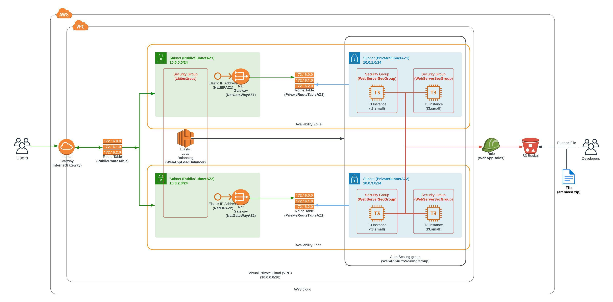
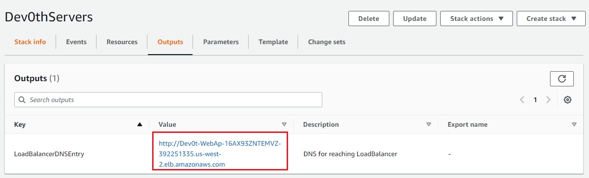
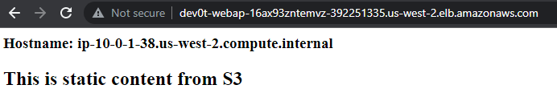
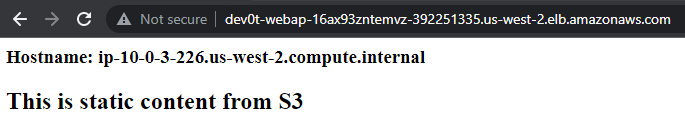
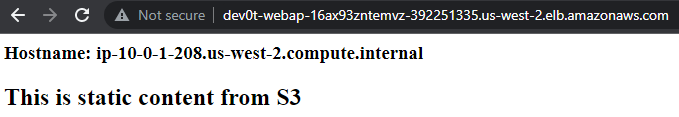
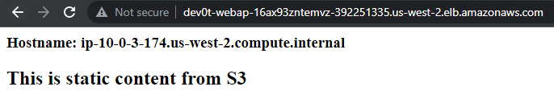

# Deploy a high-availability web app using CloudFormation
## Diagram

<div align="center">
    
</div>

## Prerequisites
AWS account with Iam role for webapp and a bucket already deployed having the webapp code. Don't forget to adapt the userData to match your webapp sources location

## How to Run
Run the following commands:

```
sh create.sh Dev0thNetwork network.yaml network-params.json
sh create.sh Dev0thServers servers.yaml servers-params.json
```

Last thing: Remember to delete your CloudFormation stack when you're done to avoid recurring charges!

```
sh delete.sh Dev0thServers
sh delete.sh Dev0thNetwork
```

## Result
View result at AWS Console CloudFormation page

<div align="center">
    
</div>

Instance 1:
<div align="center">
    
</div>

Instance 2:
<div align="center">
    
</div>

Instance 3:
<div align="center">
    
</div>

Instance 4:
<div align="center">
    
</div>


